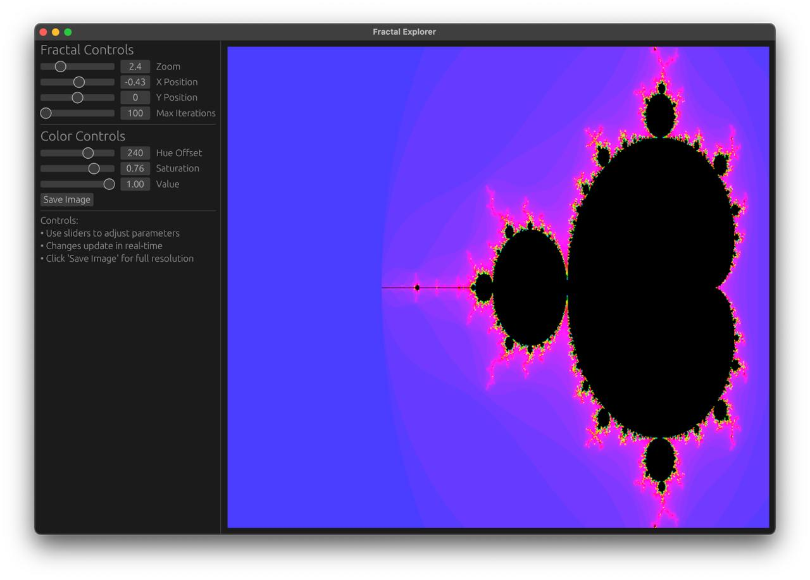

# 🌀 Fractalrs

A high-performance fractal explorer written in Rust, featuring beautiful mathematical patterns and real-time interaction.



## ✨ Features

- **Multiple Fractal Types**
  - Classic Mandelbrot
  - Spiral Patterns
  - Flower Formations
  - Phoenix Flames
  - Butterfly Designs

- **Real-time Controls**
  - Smooth pan & zoom with mouse
  - Dynamic parameter adjustment
  - Color customization
  - Random pattern generator

- **High Performance**
  - Multi-threaded rendering
  - GPU-accelerated display
  - Efficient state management
  - Responsive UI

## 🚀 Quick Start

```bash
# Clone the repository
git clone https://github.com/yourusername/fractolrs.git
cd fractolrs

# Run in release mode for best performance
cargo run --release
```

## 🎮 Controls

- **Mouse**
  - Drag to pan
  - Scroll to zoom in/out

- **UI Controls**
  - Select fractal type
  - Adjust power (2.0 - 4.0)
  - Modify shape parameters
  - Customize colors
  - Click "🎲 Randomize" for surprises!

## 🛠️ Built With

- [egui](https://github.com/emilk/egui) - Pure Rust GUI framework
- [rayon](https://github.com/rayon-rs/rayon) - Data parallelism library
- [image](https://github.com/image-rs/image) - Image processing
- [num-complex](https://github.com/rust-num/num-complex) - Complex number computations

## 📝 License

This project is licensed under the MIT License - see the LICENSE file for details.

## 🤝 Contributing

Contributions are welcome! Feel free to submit issues and pull requests.
